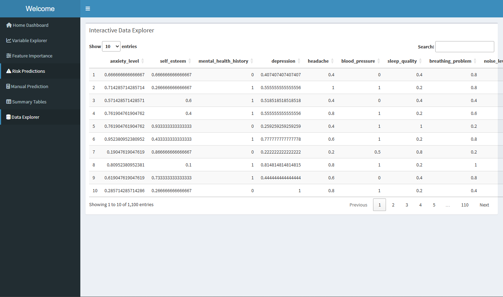
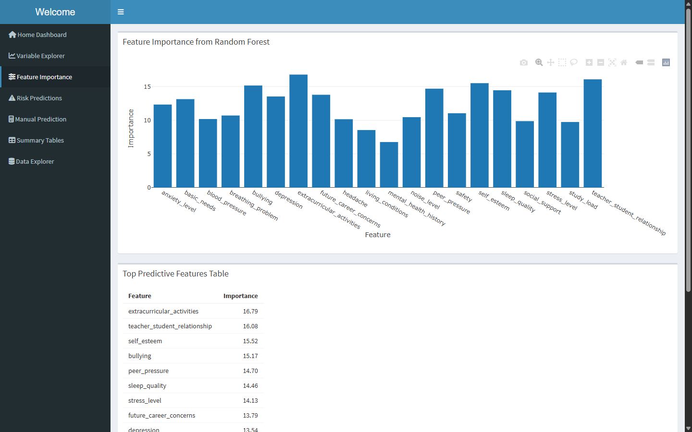
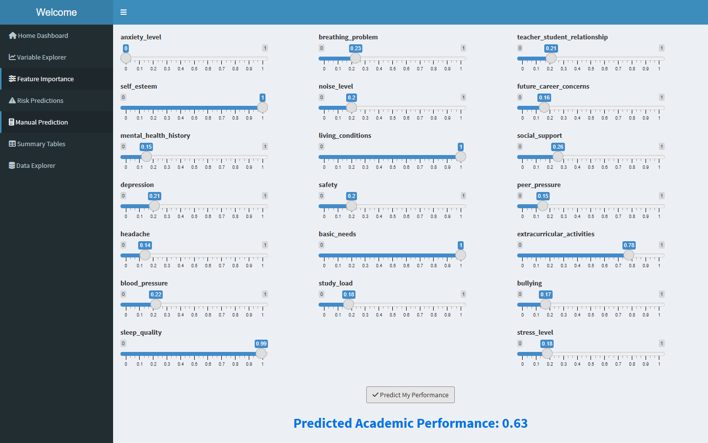

# Student-Performance-Analytics
Data-Driven Analysis of Student Habits and Performance Metrics
This repository contains R scripts for data analysis, visualization, and modeling.

## Files
- `StudentPerformanceAnalytics.R`: a script designed to analyze and provide visual representation of the factors affecting students' academic performance.
- `StudentFactorsToPerformance.csv`: a dataset with 1,100 observations collected from students across different institutions.
- `Dashboard.R`: an interactive dashboard built with Shiny for R. The dashboard allows users to visualize relationships between various student life factors and their performance.

## Requirements
- Download the latest version of [R](https://posit.co/download/rstudio-desktop/)
- Packages: `ggplot2`, `dplyr`, `shiny`, `shinydashboard`, `plotly`, `randomForest`, `corrplot`, `DT`, `tidyr`

---

## Getting Started

Follow the instructions below to download R and run the dashboard.

---

## Requirements

- R (version 4.0 or higher)
- RStudio (optional, but recommended)
- Internet connection (for installing packages)

---

## Install R

Download and install the latest version of R from CRAN:

[https://cran.r-project.org](https://cran.r-project.org)

Choose your operating system (Windows, macOS, or Linux) and follow the installation instructions.

---

## (Optional) Install RStudio

RStudio is a user-friendly IDE for R. You can download it here:

 [https://posit.co/download/rstudio-desktop/](https://posit.co/download/rstudio-desktop/)

---

## Download the Dashboard Files

Click the green **Code** button at the top of this repository, then choose:

**Download ZIP**  
Then extract the contents to your local computer.

Alternatively, use this direct download link for the main file:

- [Download `Dashboard.R`](https://raw.githubusercontent.com/robaaaru/Student-Performance-Analytics/main/Dashboard.R)
- [Download `StudentPerformanceAnalytics.R`](https://raw.githubusercontent.com/robaaaru/Student-Performance-Analytics/main/StudentPerformanceAnalytics.R)

---

## Install Required R Packages

Open R or RStudio and run the following command to install necessary packages:

```R
install.packages(c( "ggplot2","dplyr","shiny","shinydashboard","plotly","randomForest","corrplot","DT","tidyr"))
```

## Snapshots




<p align=center><i>Figure 1: Data Explorer panel showing the normalized dataset.</i></p>



<p align=center><i>Figure 2: Feature Importance panel highlighting variable weight using Random Forest.></i></p>



<p align=center><i>Figure 3: Manual Prediction Panel showing manual feature setting and its prediction.</i></p>


